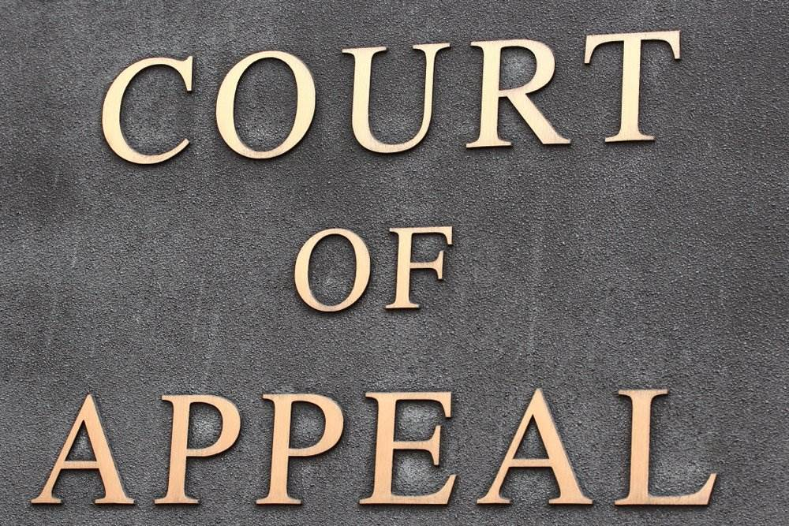

# Appeals

After a **trial concludes**, either party may submit an **appeal** challenging the verdict or sentence. Appeals are reviewed by the **Appeals Chamber**, composed of **five judges**, who reassess the fairness and legality of the trial outcome.

---

### Basis for Appeal

The Appeals Chamber considers whether the original trial was compromised by key issues:

- **Procedural Errors**  
  Examples include violations of due process, unfair treatment of the accused, or misconduct during trial proceedings.

- **Legal Errors**  
  Errors in applying or interpreting international criminal law, including misread statutes or incorrect rulings.

- **Evidentiary Issues**  
  Wrongful admission or exclusion of evidence that may have significantly influenced the outcome.

---

### Appeals Procedure

- The Appeals Chamber reviews the **trial record and written submissions**; it does **not rehear witnesses**.
- Judges may:
  - Reassess factual findings that appear unreasonable
  - Reinterpret legal arguments and correct procedural flaws

The focus is on whether the trial was conducted in a **fair, impartial, and lawful** manner.

---

### Possible Outcomes

Based on its review, the Appeals Chamber may:

- **Uphold** the original judgment and sentence  
- **Reverse** the conviction or acquittal  
- **Amend** the charges or sentence (e.g. reduce or increase punishment)  
- **Order a retrial** if critical flaws are found

---

### Roles in the Simulation

- **Appeals Judge 1, 2, & 3**  
  Each judge drafts an individual ruling and works toward a chamber-wide majority or minority opinion.

- **Appellant 1** *(Losing Party at Trial)*  
  Identifies specific legal or procedural errors and argues why the verdict should be overturned.

- **Appellant 2**  
  Proposes a preferred result—such as acquittal or sentence reduction.

- **Respondent 1** *(Winning Party at Trial)*  
  Defends the trial verdict and challenges the basis of the appeal.

- **Respondent 2**  
  Argues for confirmation of the ruling or even an increase in sentence or conviction scope.

---

### More Resources

- **[Overview of the ICC Appeals Process](https://www.icc-cpi.int/about/how-the-court-works)**
- **[Rome Statute – Part 8: Appeal and Revision](https://legal.un.org/icc/statute/99_corr/8.htm)**