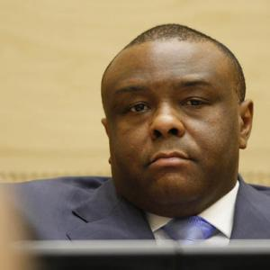

# Case

This section presents key appellate case scenarios reviewed by the International Criminal Court (ICC). These scenarios explore how legal reasoning and procedural review affect outcomes in international criminal justice.

---

*Jean-Pierre Bemba*

## Jean-Pierre Bemba (2018)

**Case Title:** *The Prosecutor v. Jean-Pierre Bemba Gombo*  
**Case Number:** ICC-01/05-01/08  
**Status:** Closed  
**Decision:** Acquitted on Appeal  
**Position of the Accused:** President and Commander-in-Chief of the Mouvement de libération du Congo (MLC)  
**Time of Alleged Crimes:** 2002–2003  
**Location:** Central African Republic (CAR)
**Official Case Page:** [https://www.icc-cpi.int/car/bemba](https://www.icc-cpi.int/car/bemba)

### Charges:
- **Crimes Against Humanity:**  
  - Murder  
  - Rape  
- **War Crimes:**  
  - Murder  
  - Rape  
  - Pillaging

### Background:
Jean-Pierre Bemba was accused of failing to prevent or punish crimes committed by his troops during their intervention in the Central African Republic, where they were allegedly involved in widespread atrocities including sexual violence and looting. He was arrested in 2008 and stood trial before the ICC.

### Trial Chamber Conviction (2016):
The Trial Chamber found Bemba guilty of all charges and sentenced him to 18 years in prison. It held that, as a military commander, Bemba bore responsibility for the actions of his forces under the doctrine of command responsibility.

### Appeals Chamber Acquittal (2018):
On 8 June 2018, the Appeals Chamber overturned the conviction in a 3-2 majority decision. It found that the Trial Chamber made serious errors in its evaluation of the evidence, particularly in assessing Bemba’s efforts to control his troops and the extent of his knowledge of the crimes. The Chamber ruled that these errors materially affected the decision and that the prosecution failed to prove guilt beyond a reasonable doubt.

### Significance:
This landmark decision highlighted the high threshold required to convict individuals under command responsibility and sparked debate about the standards of proof and the balance between accountability and fairness in international justice.

---

