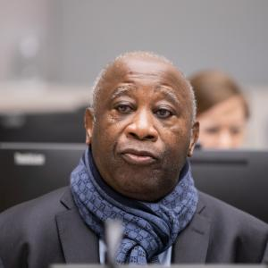

# Case

This section presents key appellate case scenarios reviewed by the International Criminal Court (ICC). These scenarios explore how legal reasoning and procedural review affect outcomes in international criminal justice.

---

*Charles Blé Goudé*

*Lauret Gbagbo*

## Gbagbo and Blé Goudé Case

**Case Title:** *The Prosecutor v. Laurent Gbagbo and Charles Blé Goudé*  
**Case Number:** ICC-02/11-01/15  
**Status:** Closed  
**Decision:** Acquitted on Appeal  
**Position of the Accused:** President of Côte d'Ivoire (Laurent Gbagbo) and Leader of the Ivorian Popular Front Youth Wing (Charles Blé Goudé)  
**Time of Alleged Crimes:** 2010–2011  
**Location:** Côte d'Ivoire  
**Official Case Page:** [https://www.icc-cpi.int/cdi/gbagbo-goude](https://www.icc-cpi.int/cdi/gbagbo-goude)

### Charges:

The charges against Laurent Gbagbo, the former President of Côte d'Ivoire, and Charles Blé Goudé, the leader of the youth wing of the Ivorian Popular Front, were primarily related to their involvement in the post-election violence in Côte d'Ivoire following the 2010 presidential elections. They faced accusations of crimes against humanity, including murder, rape, and other forms of sexual violence, as well as persecution and other inhumane acts. These charges stemmed from their alleged roles in orchestrating violence and suppressing opposition during the election crisis.

### Background:

The 2010 Ivorian presidential elections resulted in a disputed victory between Laurent Gbagbo, the incumbent president, and Alassane Ouattara, who was internationally recognized as the winner. After Gbagbo refused to step down, violent clashes erupted between supporters of both leaders, leading to widespread killings, rapes, and destruction. The ICC initiated investigations into the situation and charged Gbagbo and Blé Goudé for their roles in the violence, particularly targeting civilians, opposition figures, and perceived supporters of Ouattara.

### Trial Chamber Conviction:

In 2019, the ICC's Trial Chamber I ruled to acquit Laurent Gbagbo and Charles Blé Goudé, citing insufficient evidence to support the charges against them. The chamber concluded that the prosecution failed to establish beyond a reasonable doubt that the accused were responsible for crimes against humanity during the post-election violence. This ruling raised significant debates within the legal community regarding the standards of proof and the scope of the prosecution's responsibility in presenting a solid case.

### Appeals Chamber Acquittal:

The Appeals Chamber of the ICC, in March 2021, upheld the acquittals of Laurent Gbagbo and Charles Blé Goudé. The Appeals Chamber agreed that the Trial Chamber's decision to acquit was correct, emphasizing that the prosecution had failed to meet the required evidentiary standard for a conviction. The Appeals Chamber concluded that the evidence presented was insufficient to prove the guilt of the accused beyond a reasonable doubt.

### Significance:

The case of Gbagbo and Blé Goudé holds significant implications for international criminal justice, particularly concerning the burden of proof in war crimes and crimes against humanity cases. The acquittals highlighted the challenges faced by the ICC in prosecuting high-profile leaders, and raised questions about the court’s effectiveness in holding powerful individuals accountable. Furthermore, the ruling emphasized the importance of ensuring that prosecutions are based on credible evidence and that accused individuals are given fair trials under international law.

---