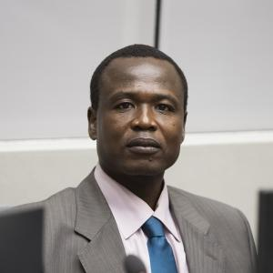

# Case

This section presents key appellate case scenarios reviewed by the International Criminal Court (ICC). These scenarios explore how legal reasoning and procedural review affect outcomes in international criminal justice.

---

## The Prosecutor v. Dominic Ongwen

*Dominic Ongwen*

## Ongwen Case

Case Title: The Prosecutor v. Dominic Ongwen  
Case Number: ICC-02/04-01/15  
Status: Sentence Being Served  
Decision: Convicted and Sentence Confirmed on Appeal  
Position of the Accused: Brigade Commander of the Sinia Brigade of the Lord’s Resistance Army (LRA)  
Time of Alleged Crimes: 2002–2005  
Location: Northern Uganda  
**Official Case Page:** [https://www.icc-cpi.int/uganda/ongwen](https://www.icc-cpi.int/uganda/ongwen)

### Charges:
61 counts of war crimes and crimes against humanity, including murder, enslavement, torture, forced marriage, and conscription of child soldiers. Crimes were allegedly committed between 1 July 2002 and 31 December 2005 in northern Uganda.

### Background:
Dominic Ongwen, a senior commander in the LRA, was the subject of an arrest warrant issued in July 2005 and unsealed in October 2005. He was transferred to the ICC in January 2015. Ongwen was both a perpetrator and former child victim of the LRA, raising complex legal and moral questions throughout the proceedings.

### Trial Chamber Conviction:
Trial Chamber IX found Ongwen guilty on 4 February 2021. He was sentenced to 25 years of imprisonment on 6 May 2021. The chamber acknowledged his personal victimization but emphasized his responsibility for extensive crimes affecting civilians.

### Appeals Chamber Ruling:
On 15 December 2022, the Appeals Chamber upheld the conviction and sentence. On 18 December 2023, Ongwen was transferred to Norway to serve his sentence. On 28 February 2024, the Trial Chamber issued an order for reparations to victims. The Appeals Chamber confirmed this reparations order on 7 April 2025.

### Significance:
The Ongwen case is a landmark in the history of international law due to the unique circumstances of the accused—a former child soldier turned commander. It underscores the ICC’s capacity to navigate complex issues of victim-perpetrator duality, while reinforcing accountability and reparations in post-conflict justice.

---
